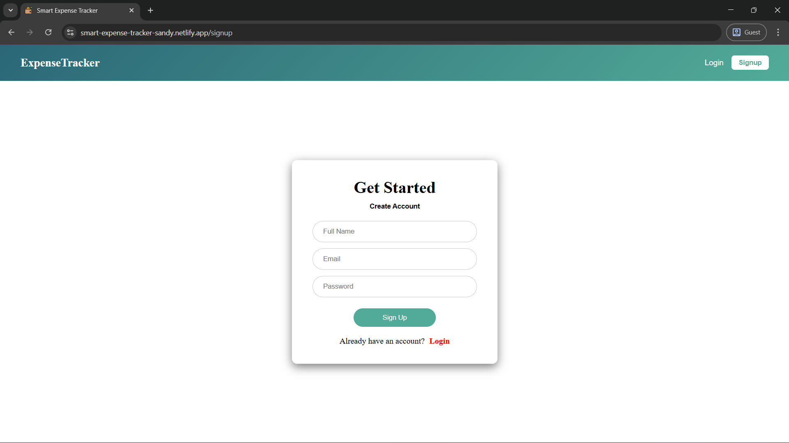
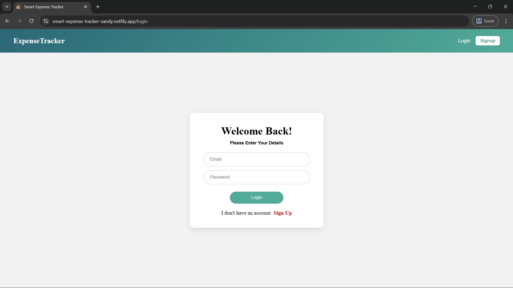
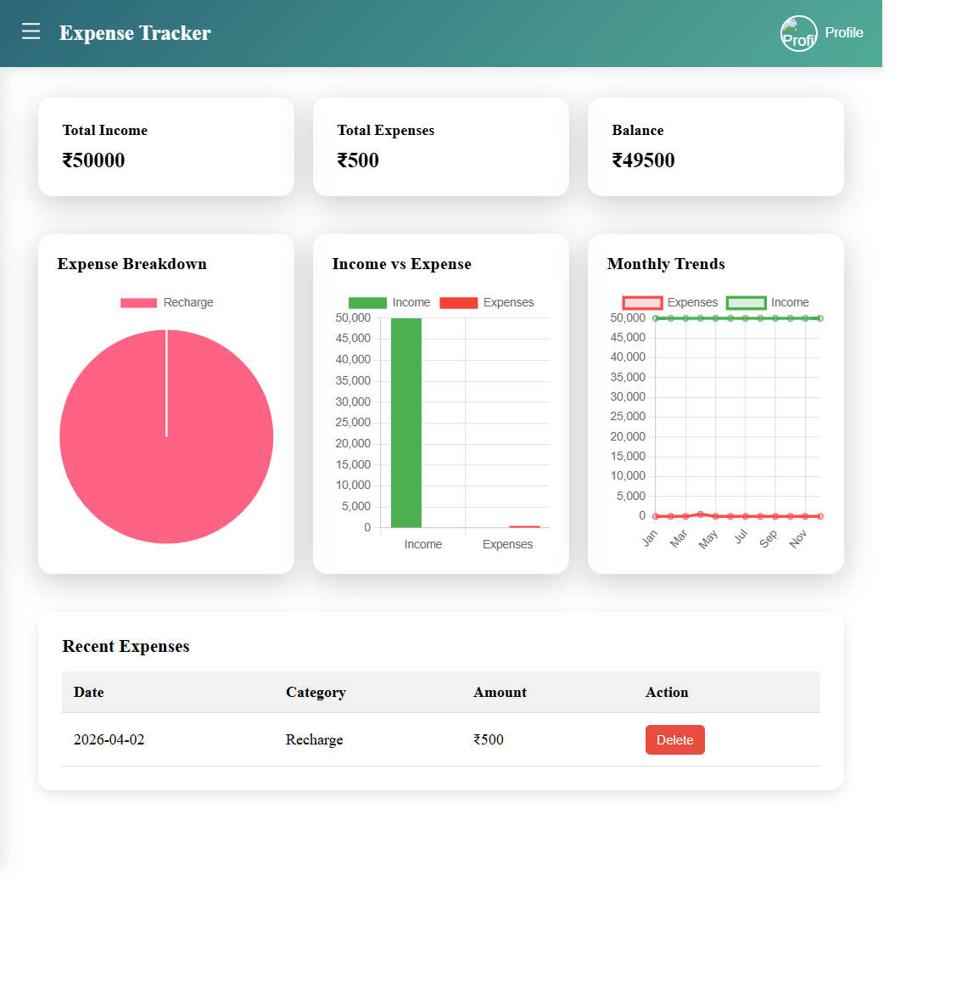

# 💰 Expense Tracker Application


A full-stack web application to manage and track daily expenses and income securely and efficiently.

---

## 🚀 Live Demo

* 🌐 **Frontend:** https://smart-expense-tracker-sandy.netlify.app/
* 🔗 **Backend:** https://expense-tracker-ldlx.onrender.com
---


## 📸 Screenshots

### 🔐 Signup Page

```md

```

### 🔑 Login Page

```md

```

### 📊 Dashboard

```md

```

### 💵 Add Expense

```md

```

---

## ✨ Features

* 🔐 JWT-based authentication
* 💵 Expense & income management
* 📊 Real-time balance updates
* 📁 Category-based tracking
* 📱 Responsive UI
* 🔒 Secure backend APIs

---

## 🛠️ Tech Stack

### Frontend

* React.js
* HTML, CSS, Bootstrap
* Axios

### Backend

* Java
* Spring Boot
* Spring Security

### Database

* PostgreSQL

### Deployment

* Netlify (Frontend)
* Render (Backend)

---

## ⚙️ Setup Instructions

### Clone Repo

```bash
git clone https://github.com/Sandhoshkumar02/Expense-Tracker.git
```

### Backend

```bash
cd backend
mvn clean install
mvn spring-boot:run
```

### Frontend

```bash
cd frontend
npm install
npm run dev
```

---

## 🔑 Environment Variable

```env
VITE_API_URL=https://expense-tracker-ldlx.onrender.com/api
```

---

## 👨‍💻 Author

**Sandhoshkumar B**
GitHub: https://github.com/Sandhoshkumar02

---

## ⭐ Support

Give a ⭐ if you like this project!
